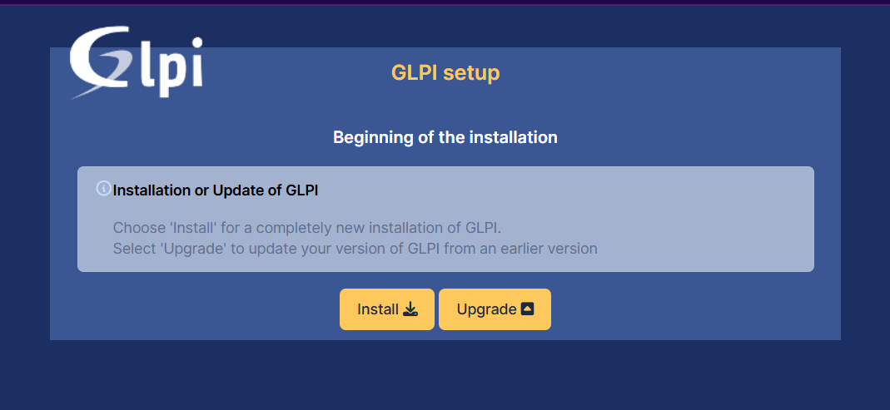
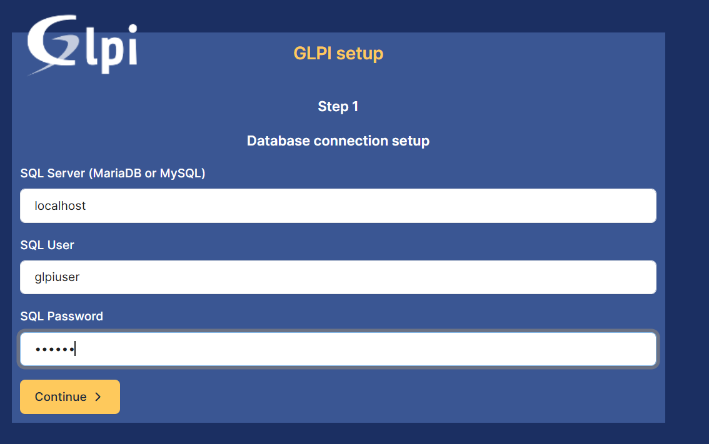
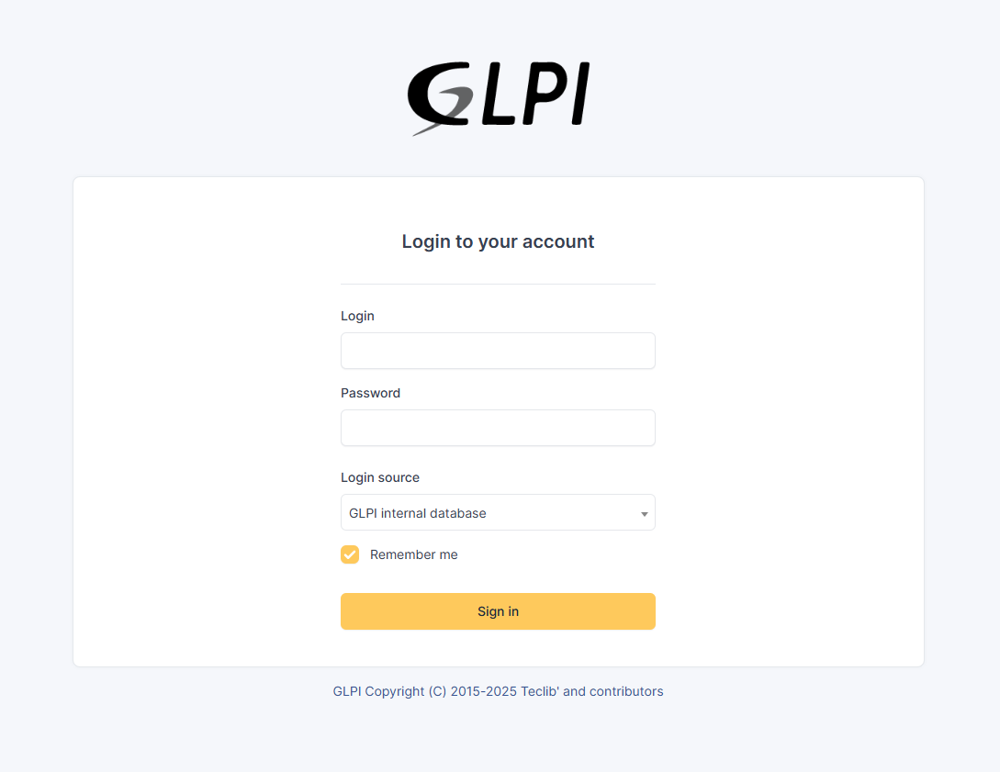
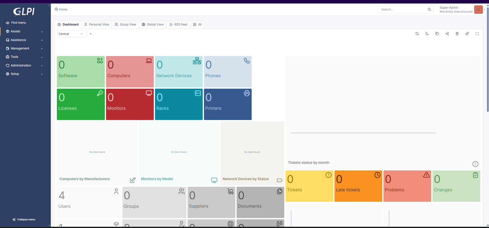

# GLPI 11 Installation on Fedora 43

This project explains how to install GLPI 11 on Fedora Linux using Apache, MariaDB and PHP.

## Environment

- Fedora 43
- Apache Web Server
- MariaDB
- PHP
- GLPI 11

## Architecture

Fedora 43
│
├── Apache (Web Server)
├── PHP
├── MariaDB (Database)
└── GLPI 11

## Installation Steps

1. Install Apache
2. Install MariaDB
3. Create Database
4. Install PHP
5. Create Database
6. Install GLPI
7. Configure permissions
8. Configure Apache VirtualHost
9. Access GLPI via browser

## Access

## Screenshots

